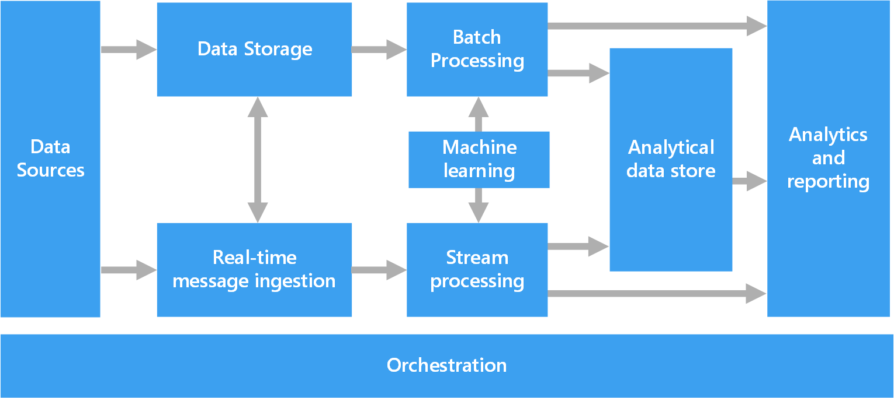
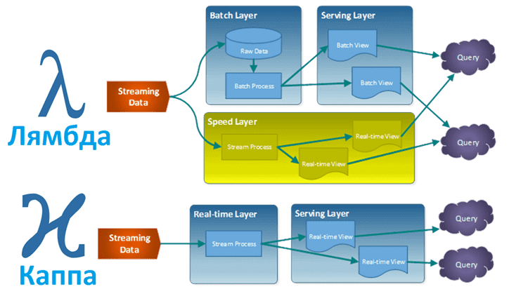

# Architectures for BigData processing

Logic components, that go into a big data architecture.



## Lambda vs Kappa



для Kappa характерны следующие достоинства:

* повторная обработка данных нужна только при изменении кода;
* требуется меньше ресурсов в связи с одним путем обработки данных;
* на сервисном уровне в качестве неканонического хранилища можно использовать практически любую базу данных.


### Lambda architecture

### Kappa architecture


Функциональное уравнение, которое определяет запрос Big Data, в Каппа-архитектуре:
```
Query = K (New Data) = K (Live streaming data)
```

Для реализации Каппа-архитектуры используются следующие:
* канонические хранилища для постоянного логгирования событий, например, Apache Kafka, Apache Pulsar, Amazon Quantum Ledger Database, Amazon Kinesis, Amazon DynamoDB Streams, Azure Cosmos * DB Change Feed, Azure EventHub и другие подобные системы;
* фреймворки потоковых вычислений, например, Apache Spark, Flink, Storm, Samza, Beam, Kafka Streams, Amazon Kinesis, Azure Stream Analytics и другие streaming-системы;
* на сервисном уровне может использоваться практически любая база данных, резидентная (в памяти) или постоянная, в т.ч. хранилища специального назначения, например, для полнотекстового поиска.


## Links

> https://docs.microsoft.com/ru-ru/azure/architecture/data-guide/big-data/
> https://www.bigdataschool.ru/blog/kappa-architecture.html

https://www.machinelearningmastery.ru/a-brief-introduction-to-two-data-processing-architectures-lambda-and-kappa-for-big-data-4f35c28005bb/

https://docs.microsoft.com/ru-ru/azure/architecture/data-guide/big-data/

http://milinda.pathirage.org/kappa-architecture.com/