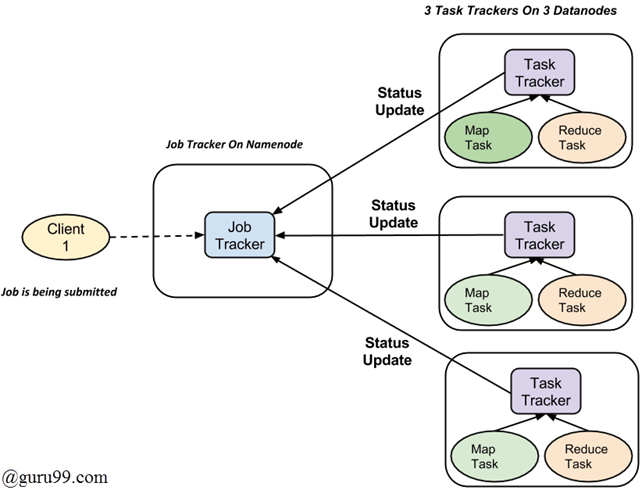

# Hadoop

## MapReduce

Hadoop divides the job into tasks. There are two types of tasks:

* Map tasks (Splits & Mapping)
* Reduce tasks (Shuffling, Reducing)

The complete execution process (execution of Map and Reduce tasks, both) is controlled by two types of entities called a

Jobtracker: Acts like a master (responsible for complete execution of submitted job)
Multiple Task Trackers: Acts like slaves, each of them performing the job
For every job submitted for execution in the system, there is one Jobtracker that resides on Namenode and there are multiple tasktrackers which reside on Datanode.

* A job is divided into multiple tasks which are then run onto multiple data nodes in a cluster.
* It is the responsibility of job tracker to coordinate the activity by scheduling tasks to run on different data nodes.
* Execution of individual task is then to look after by task tracker, which resides on every data node executing part of the job.
* Task tracker's responsibility is to send the progress report to the job tracker.
* In addition, task tracker periodically sends 'heartbeat' signal to the Jobtracker so as to notify him of the current state of the system. 
* Thus job tracker keeps track of the overall progress of each job. In the event of task failure, the job tracker can reschedule it on a different task tracker.
