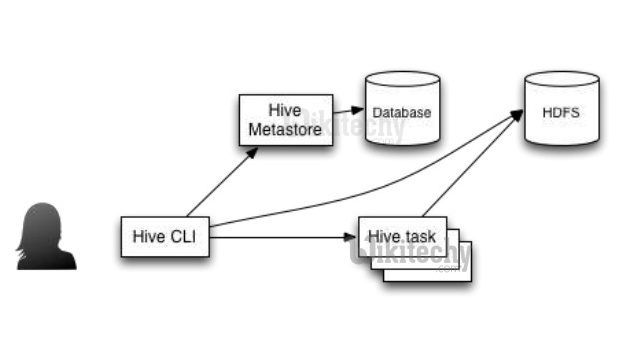
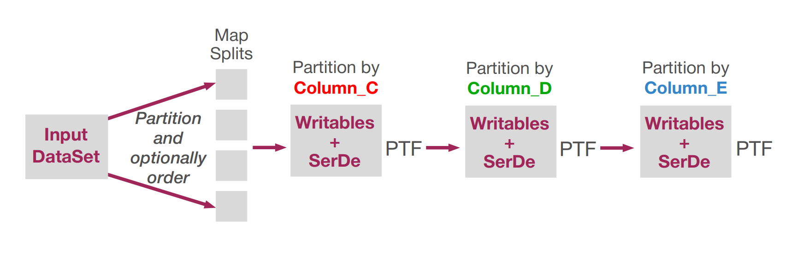
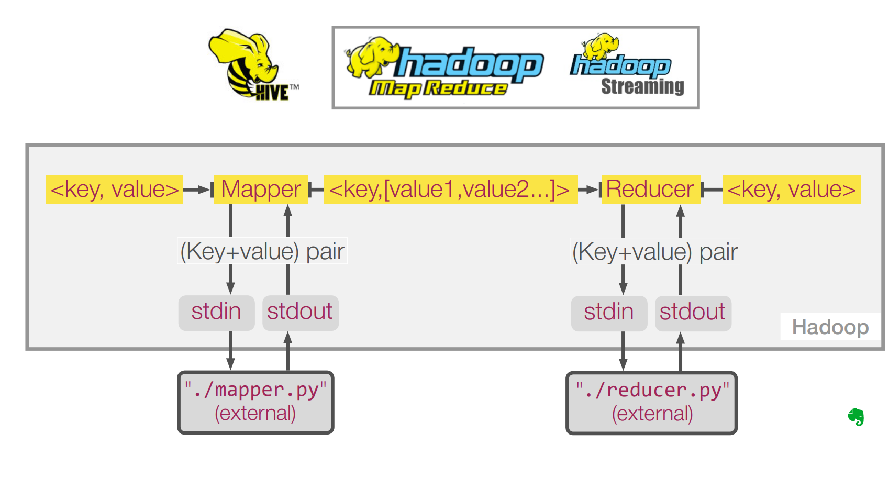
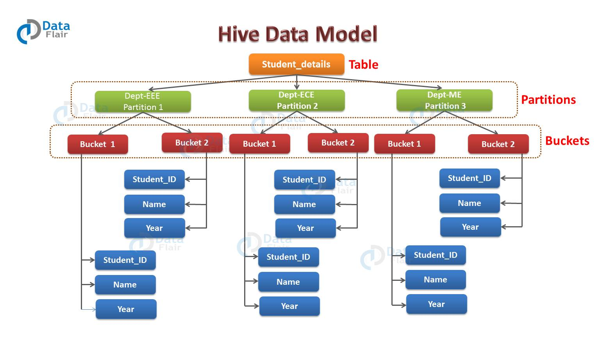
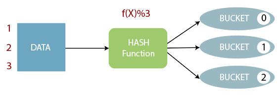
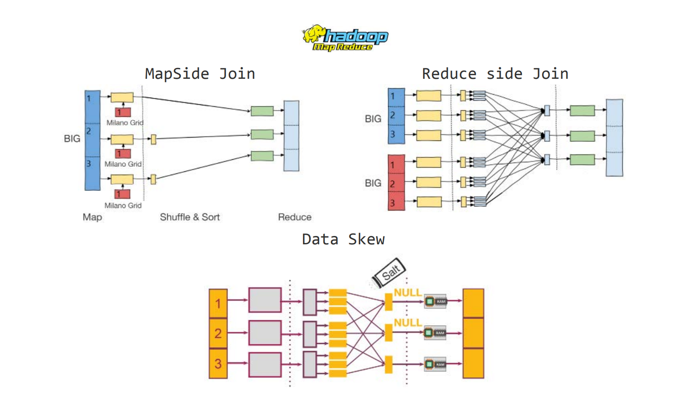
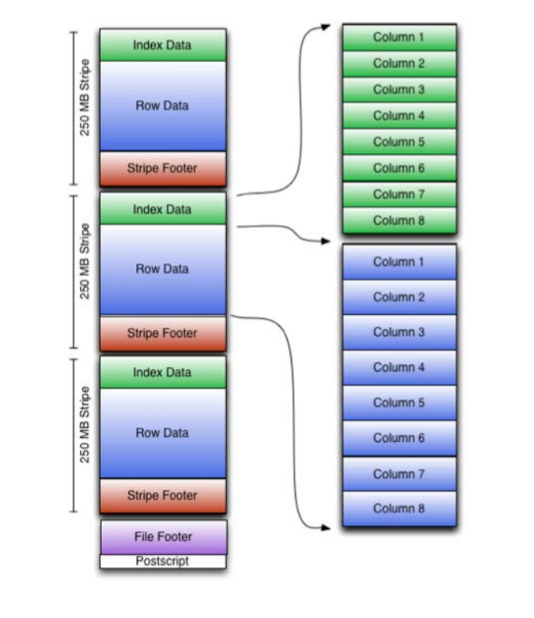
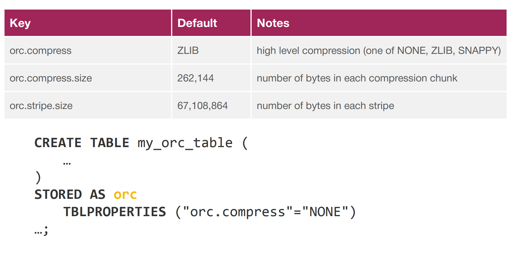

# Map Reduce

## languages for batch processing MapReduce

There are two most popular high-level programming languages for batch processing MapReduce pipelines:
* Hive  (HIVE QL)
Hive is a declarative language focused on the semantic of what you would like to achieve. 
Hive is quite similar to a Structured Query Language also known as SQL.

* Pig
Pig is a procedural language used to explain in script how you would like to process your data. 

### HIVE

Hive was originally developed as a data warehouse solution at Facebook.
Hive can work on top of different execution layers, such as Apache Tez and Spark.

Hive defines a concept of a Metascore. 
Metastore provides information about data layout in HDFS. It is different from HDFS Namenode, because it helps to answer the question, what exactly is stored in particular folder. For example, if you have a batch stored in HDFS, then Namenode answers the questions where our blocks of files allocated. And metascore explains that the first field in the lock line is IP address. The first field is date and so on.
Metastore - stores the metadata for Hive tables,it separates in relational database,the client use to access the information from API(Application Programming Interface).
Metastore - for random reads and updates



Hive provides a low-latency access for the metastore objects.

DDL
`^A` - ASCII code as a default delimiter

Hive tables can be *managed* or *external*. *Managed* is a default option. 
If you create a managed table, then Hive is responsible to manage data in HDFS. So if you drop a table, then Hive will remove table metadata and will remove data in HDFS. 
But if you use an external table, then data in HDFS will be left unchanged. DROP statement will only remove table metadata. 
In addition to managed or external tables, there are temporary ones, so it will be automatically removed after the Hive session is closed.

Several extra options you can control:
COLLECTION ITEMS delimiter, Ctrl B, 
MAP KEY value delimiter, Ctrl C, 
LINES delimiter, and special characters for escaping, and null value. 
LINES are delimited by by default, which is natural. 

Default storage format is TEXTFILE, which is a plain text.

### DML

First, if you have data in HDFS folder, then you can move it into Hive warehouse location with the following DML query. 
By default, data that you move into Hive warehouse location is added into existing files in HDFS folder.  If there are files with the same names, then they will be over written.
You can create and populate one Hive tables with the help of the others. it is the most common workflow.

CTAS - create table as select
`EXPLAIN <some_queue>` -  In the output, you'll see how your query is parsed into abstract syntax tree, how many stages you have and what is the connection between them. And most importantly, you'll see detailed information about each stage. So, you should be able to figure out what will exactly happen during the execution, and where you will have map or reduce phases.

RegexSerDe - Row format is used to explain how to serialize Hive row objects into bytes to store in HDFS and deserialize from bytes back into Hive row object.
SERDE - is a shortcut for serialization and deserialization library.
For RegexSerde, you have to provide regular expression groups that correspond to table columns. 


`CREATE VIEW <view_name>`. Then a list of columns without data types (Data types will be extracted automatically from SELECT query). `AS SELECT` statement to populate this view.
View schema reflects connection to tables or other views at the time of writing. If corresponding tables of use are updated then this view could become invalid. And you will see errors at the time of running HiveQL query.
View is a read only table that is only stored as metainformation and generated on the fly than necessary.

### Hive Analytics: UDF, UDAF, UDTF

> https://cwiki.apache.org/confluence/display/Hive/LanguageManual+UDF
> https://cwiki.apache.org/confluence/display/Hive/LanguageManual+LateralView

`show functions` - list of all func
`descride function <func_name>` or `descride function extended <func_name>` - man for func

**Operations**
Ex: =, !=, <, >, IS NULL, +, -, *, /, AND, OR, IN, ...

**Functions (UDF - User Defined Functions)**
or string functions
Used for 1:1 matching. Map phase
Ex:
math: round, floor, ceil, exp, log, …
date: to_date, from_unixtimestamp, year, …
conditional: if, isnull, case, coalesce, …
string: char, concat, lower, trim, repeat, …

`concat_ws` function to concatenate values with ^ as a delimiter.
Example with constants:
```sql
hive> select concat_ws('^','ABCD','10', 'XYZ');
OK
ABCD^10^XYZ
```


**Agregate (UDAF)**
Ex: sum, agv, min, max, corr.
Reduser phase
Used for n:1 matching. Collection of rows


**Table-generating functions (UDTFs)**
Ex: explode, posexplode, parse_url_tuple, …
Used for PTF m:n and 1:n matching
May be develop jar -> add jar with the help of a distributed cache. 
can `create temporary function <func_name> as "java.class.name"` - attach hyper store
Can be used in Map and in Reduse phase

```sql
ADD JAR /opt/cloudera/parcels/CDH/lib/hive/lib/hive-contrib.jar;
ADD JAR /opt/cloudera/parcels/CDH/lib/hive/lib/hive-serde.jar;
```
hive-contrib - for
hive-serde - for building custom Hive SerDes.

**PTF**
(Window functions)
m:n matching
can spawn a chain of MapReduce jobs.

partition our dataset with the help of partitioner. On each partition you apply a function for a rolling window. Size of a window can change dynamically during execution.

```SQL
SELECT column_A,
 ROW_NUMBER() OVER (PARTITION BY column_C),
 RANK() OVER (PARTITION BY column_C),
 DENSE_RANK() OVER (PARTITION BY column_C)
FROM table_name;
```
same as with window
```SQL
SELECT column_A,
 ROW_NUMBER() OVER w,
 RANK() OVER w,
 DENSE_RANK() OVER w
FROM table_name
WINDOW w AS (PARTITION BY column_C);
```
For each window function you will have a special object on the work note to store results. Hive framework will iterate over the input trials and to push them down to window operators. Each operator will emit an output field. Then Hive framework gathers items from different operators into a row. But if you have different windows, then Hive framework will process a query in multiple MapReduce tabs. One MapReduce stage will correspond to evaluation of functions over one of the window partitions. This window partitions will be evaluated sequentially one by one, to unfold a list of attributes in a row during each iteration.




### Hive Streaming

> https://cwiki.apache.org/confluence/display/Hive/LanguageManual+Transform

```SQL
FROM my_table
SELECT TRANSFORM (column_A, column_B)
USING "/bin/cat"
AS (new_A STRING, new_B DOUBLE)
```

SELECT TRANSFORM statement is used for such purpose. The syntax of TRANSFORM is the following. TRANSFORM and a list of columns to process, USING and a streaming script, optional AS clause with a list of output fields. Output of streaming script would always be a string. That is why there are several options to specify output fields and data types. For instance, you can specify data types within parentheses along with field names. 



map and reduce streaming

There is no difference from TRANSFORM syntax point of view, but there is a way to persuade Hive to execute some scripts during a map phase and others during a reduce phase. 

During the reduce phase you take pairs sorted by words, accumulate word_count and emit the final statistics. For simplicity, I call scripts mapper.py and reducer.py. The magic clause to execute reducer.py in a proper way is a `DISTRIBUTE BY` clause.

`DISTRIBUTE BY` is essentially an implementation of a partition. You can partition or `DISTRIBUTE BY` any set of columns and even use the simple operators and UDF functions.

In addition to partitioning, you can request some sorting. All the complexities to perform a secondary sort will disappear. If you distribute and sort by the same fields, then I advise you to take a look at the `CLUSTER BY` statement. It is a shortcut for `DISTRIBUTE` and `SORT BY`.

One more tip. Please don't use map and reduce HiveQL statements or at least use them with care. They're essentially synonyms to transform statement. But they will not guarantee you that your streaming scripts will be executed during map or reduce phase. It is only controlled by `DISTRIBUTE` or `CLUSTER BY` clauses.
`cluster by = distribute by + sort by`


Hive users who are starting to use streaming scripts to extend Hive functionality happen to forget add in scripts to a distributed cache. So scripts become available during execution. The semantics of this functionality is the following, `ADD FILE` and a file name. See working example of Hive streaming WordCount solution on the slide. There are `ADD FILE` statements, `TRANSFORM` clauses, `DISTRIBUTE` and `SORT BY` to control execution on a reduce HIve. And everything is in one simple HiveQL query. The power of Hive is unleashed.


### Hive Optimization: Partitioning, Bucketing and Sampling

> https://cwiki.apache.org/confluence/display/Hive/LanguageManual+Sampling
> https://cwiki.apache.org/confluence/display/Hive/LanguageManual+DDL+BucketedTables



#### Partitioning

Apache Hive organizes tables into partitions for grouping same type of data together based on a column or partition key. 
Each table in the hive can have one or more partition keys to identify a particular partition. Using partition we can make it faster to do queries on slices of the data.

The Hive command for Partitioning is:
```SQL
CREATE TABLE table_name (column1 data_type, column2 data_type) PARTITIONED BY (partition1 data_type, partition2 data_type,….);
```
if you can skip data region from a disk, then you would better do it.

You can have a nested folder structure. For instance, you can group your data in HDFS by year, by month, and then by day. Hive DDL query used for creating a table against it And when you spawn HiveQL query, the framework will automatically determine folders to be read or skipped.


+ It distributes execution load horizontally.
+ In partition faster execution of queries with the low volume of data takes place. For example, search population from Vatican City returns very fast instead of searching entire world population.
- There is the possibility of too many small partition creations- too many directories.
- Partition is effective for low volume data. But there some queries like group by on high volume of data take a long time to execute. For example, grouping population of China will take a long time as compared to a grouping of the population in Vatican City.
- There is no need for searching entire table column for a single record.


**Static partitioning**
Static partitioning means that you have already sharded data in the appropriate directories. With static partitions, you add Hive partitions manually based on the directory location.

Partitioned tables can be created using the PARTITIONED BY clause.

* We need to manually create each partition before inserting data into a partition	
* We need to know all partitions in advance. So it is suitable for use cases where partitions are defined well ahead and are small in number
* Departments, State Names, etc		

**Dynmic prtitioning**
Dynamic partitioning means that you want Hive to create partitions automatically for you. Since you have already created the partitioning table from the staging table, all you need to do is insert data to the partitioned table

* The dynamic partitioned columns have to be specified after all other columns in the SELECT statement.
* Partitions will be created dynamically based on input data to the table.
* The order of dynamic partitions is important. They have to be specified in the same order in the `SELECT` clause as in the `PARTITION` clause.
* Dynamic partitions are suitable when we have lot of partitions and we can not predict in advance new partitions ahead of time.
* If you expect a huge amount of files and partitions to be generated, you would better increase Hive configuration parameters values. For `max.dynamic.partitions.pernode`, overall `max.dynamic.partitions`, and `max.created.files`. To prevent users from mistakenly populating the Hive table by empty partitions, you can also set the flag `error.on.empty.partition` to `true`. 
* dynamic partitions have to be specified after all static partitions in the `PARTITION` clause.
* Populating dynamic partitions takes longer than static partitions
* Date, city names etc

Advantages of Dynamic Partition
* Good for loading huge files in tables.
* Row wise data is read.
* Partition is based on memory and RAM available, so resources are utilized well all over.
* Generally used to load data from the non-partitioned table.
* If columns count is unknown and we want to partition data based on columns, a dynamic partition is used.
* Data load is distributed horizontally.
* Generally, the query processing time is reduced.
* The column values over which partition is to be done are known at RUN TIME.
* We can use to load data from the table that is not partitioned.
* Both external and managed tables can be used for dynamic partition.

Disadvantages of Dynamic Partition
* It generally takes more time in loading data as compared to static partition.
* We cannot perform alter on Dynamic Partition.
* Having large no of partition makes the possibility of creating overhead for NameNode.
* Query processing sometimes can take more time to execute.
* It can sometimes be a costly operation.

By the way, you can easily mix static and dynamic partitions. 

To Enable the dynamic partition, we use the following HIVE Commands:
`set hive.exec.dynamic.partition=true;`
This will set the dynamic partitioning for our hive application.
And one more thing other than setting the partition to true you need to set mode to nonstrict:
`set hive.exec.dynamic.partition.mode=nonstrict`

#### Bucketing

Bucketing is a data organization technique.
Buckets in hive is used in segregating of hive table-data into multiple files or directories. bucketing offers the additional functionality of dividing large datasets into smaller and more manageable sets called buckets. it is used for efficient querying.

Bucketing can be followed by partitioning, where partitions can be further divided into buckets. 

The Hive command for Bucketing is:
```sql
CREATE TABLE table_name PARTITIONED BY (partition1 data_type, partition2 data_type,….) CLUSTERED BY (column_name1, column_name2, …) SORTED BY (column_name [ASC|DESC], …)] INTO num_buckets BUCKETS;
```


`CLUSTERED BY` clause is used to do bucketing in Hive. The `SORTED BY` clause ensures local ordering in each bucket, by keeping the rows in each bucket ordered by one or more columns. The plausible cases when bucketing should be favoured are:



* The concept of bucketing is based on the hashing technique. The hash_function depends on the kind of the bucketing column you have.
* Here, modules of current column value and the number of required buckets is calculated (let say, F(x) % 3).
* This function requires you to use the Clustered By clause to divide a table into buckets. 
* In the table directory, the Bucket numbering is 1-based and every bucket is a file.
* Bucketing is a standalone function. This means you can perform bucketing without performing partitioning on a table.
* A bucketed table creates nearly equally distributed data file sections. 
* Note that bucketing doesn’t ensure your table would be properly populated. So you’ll have to manage the Data Loading into the buckets yourself, which can be cumbersome. 
* Based on the resulted value, the data is stored into the corresponding bucket.
* You should keep in mind that the Records with the same bucketed column would be stored in the same bucket. 
* quantity of buckets in a table is a tradeoff between namenode RAM usage and possible optimizations during Hive query executions.
* set corresponding quantity of reducers.
* Distribute data by bucket columns.
* And sort data if necessary.
+ It provides faster query response like portioning.
+ In bucketing due to equal volumes of data in each partition, joins at Map side will be quicker.
- We can define a number of buckets during table creation. But loading of an equal volume of data has to be done manually by programmers.

Neet when:
* When a column has a high cardinality, we can’t perform partitioning on it. A very high number of partitions will generate too many Hadoop files which would increase the load on the node. That’s because the node will have to keep the metadata of every partition, and that would affect the performance of that node.
* You should use bucketing if your queries have several map-side joins. A map-side join is a process where you join two tables by only using the map function without using the reduce function. 

you can define how many buckets should be in each partitioned folder. How data is distributed over these files.
Backeting can be use with partitioning

`hive.enforce.bucketing` if `true`, then Hive framework adds the necessary MapReduce stages to distribute and sort data automatically.

sampling - you can reat 25% of data to answer to the question
```SQL
SELECT ip, ...
FROM granular_access_log
 TABLESAMPLE (BUCKET 1 OUT OF 4 ON user_id)
```

Ex:
Suppose you have access logs sorted by user_id. Word count problem to calculate the number of occurrences of each user_id can be solved within map phase only, without calling shuffle and sort and reduce phases. So if you find yourself frequently clustering data by a fixed set of columns, then an intermediate Hive table with configured buckets can save you a lot of resources.

### Hive Map-Side Joins: Plain, Bucket, Sort-Merge

> https://cwiki.apache.org/confluence/display/Hive/LanguageManual+Joins
> https://cwiki.apache.org/confluence/display/Hive/LanguageManual+JoinOptimization
> https://cwiki.apache.org/confluence/display/Hive/Configuration+Properties
> https://cwiki.apache.org/confluence/display/Hive/LanguageManual+DDL#LanguageManualDDLBucketedSortedTables



When you have several Hive tables to join, the default MapReduce implementation is a reduce side join. But tables meta information can help Hive Framework to transform reduce side join into optimized version of MapSide join such as plain MapSide join, back-end join, and sort nodes back-end join.

Having solved this problem with Hadoop MapReduce, you manually put a small table into a distributed cache. Hive Framework is doing similar work:
1. client node: download small table <— HDFS
2. build hashtable
3. upload hashtable —> Distributed Cache

> What are the drawbacks and limitations of this approach?
> data transfer to the client machine and hashtable creation could become bottlenecks due to the network bandwidth, the local disk space, the memory size and CPU limitations.

**Map Join**

* Map-side join is faster because join operation is done in memory.
* In upload hashtable —> Distributed Cache stage Map task loads the hashtable into the memory from the local disk and uses it to much join keys while streaming a big table. No reduced tasks are involved in this process
* Sorted by the same key.
* Equal number of partition.
* All the records of the same key should be in same partition.

Tables bucketed and joined by the same set of columns can benefit from bucket map side join.


**Reduce join**

Reduce-Side joins are more simple than Map-Side joins since the input datasets need not to be structured. But it is less efficient as both datasets have to go through the MapReduce shuffle phase. the records with the same key are brought together in the reducer. We can also use the Secondary Sort technique to control the order of the records.

* Much flexible to implement.
* There has to be custom WritableComparable with necessary function over ridden.
* We need a custom partitioner.
* Custom group comparator is required.
* The key of the map output, of datasets being joined, has to be the join key – so they reach the same reducer.
* Each dataset has to be tagged with its identity, in the mapper- to help differentiate between the datasets in the reducer, so they can be processed accordingly.
* In each reducer, the data values from both datasets, for keys assigned to the reducer, are available, to be processed as required.
* A secondary sort needs to be done to ensure the ordering of the values sent to the reducer.
* If the input files are of different formats, we would need separate mappers, and we would need to use MultipleInputs class in the driver to add the inputs and associate the specific mapper to the same.


**Buckets**

if two tables have the same amount of buckets. Each matter processing a file split from a big table retrieves only the corresponding bucket of a small table to complete the join task.
If there is a different number of buckets in tables, then you should remember the following rule of thumb. Data in a bucket is defined by a hash of column or a set of columns, and then divided by the number of buckets in a table.

Ex:
So having 2 buckets in one table and 4 buckets in another one, you can easily find out that the first bucket from table one will correspond to buckets 1 and 3 in the second table.

Having 2 buckets in table one and 10 buckets in table two, the first bucket in table one will correspond to all buckets in table two. But having 3 buckets in table one and 5 buckets in table two, you have to read all data from the other table to perform a join. That is why I recommend you to always use a power of 2 as a number of buckets in tables. Even if you have a different number of buckets in tables, you will still be able to benefit from bucket MapSide join.

you can split buckets.
If you use the power of ten, then you will increase NameNode RAM usage for this table by a factor of ten. 

External sorting is based on a merge-sort algorithm, where you read continuous chunks of data only when necessary.
Similarly, sort-merge bucket join will read into memory only the items for a particular key. Perform a join, output generated pairs, free up the memory and move to the next key. At the time of shooting this video, it is by far the most efficient type of joins in Hive.


### Hive Optimization: Data Skew

> Data can be “skewed”, meaning it tends to have a long tail on one side or the other. Example of long tail towards positive side
> Single reducer issue can also be called SKEWED JOIN issue.


> https://cwiki.apache.org/confluence/display/Hive/LanguageManual+DDL#LanguageManualDDL-SkewedTables
> https://cwiki.apache.org/confluence/display/Hive/ListBucketing
> https://cwiki.apache.org/confluence/display/Hive/Skewed+Join+Optimization


However, let’s assume if table A join B, and A has skew data “1” in joining column.
At First store, the rows with key 1 in an in-memory hash table and read B. Further to read A  run a set of mappers. Afterward, do the following:
* Make sure use the hashed version of B to compute the result since it has key 1.
* Then, send all other keys to a reducer which does the join. Basically, from a mapper, this reducer will get rows of B also.


**Solutions**

1. **Separate Queries**
use two or more stages pipeline. We call this technique, salting. Distribute by clause can be used in Hive to reproduce the same behavior.

Example:
Execute the query excluding the SKEWED values. Something like:
```sql
select *from FACT f
  left join DIMENSION d
    on f.CODE_ID = d.CODE_ID
where f.CODE_ID <> 250
```
Execute the query with only SKEWED values. Something like:
```sql
select * from FACT f
  left join DIMENSION d
    on f.CODE_ID = d.CODE_ID
where f.CODE_ID = 250  and d.CODE_ID = 250
```

+ Simple change in the query will avoid the skew join.
+ Helpful when query is simple.
- You need to re-write same query twice.
- It will be harder to write 2 separate queries if original query is complex.
- Whenever you want to modify the query, it needs to be done at 2 separate places. If something is missing then it will be hard to debug.

2. **Using Hive Configuration**

You can enable Skew join optimization using hive configuration. Applicable settings are:

`set hive.optimize.skewjoin=true;` - Whether to enable skew join optimization. The algorithm is as follows: At runtime, detect the keys with a large skew. Instead of processing those keys, store them temporarily in an HDFS directory. In a follow-up map-reduce job, process those skewed keys. The same key need not be skewed for all the tables, and so, the follow-up map-reduce job (for the skewed keys) would be much faster, since it would be a map-join.

`set hive.skewjoin.key=500000;` - Determine if we get a skew key in join. If we see more than the specified number of rows with the same key in join operator, we think the key as a skew join key.

`set hive.skewjoin.mapjoin.map.tasks=10000;` - Determine the number of map task used in the follow up map join job for a skew join. It should be used together with `hive.skewjoin.mapjoin.min.split` to perform a fine grained control.

`set hive.skewjoin.mapjoin.min.split=33554432;` - Determine the number of map task at most used in the follow up map join job for a skew join by specifying the minimum split size. It should be used together with hive.skewjoin.mapjoin.map.tasks to perform a fine grained control.

+ No need to change the query.
+ Simple change in the setting will improve the performance.
- Above solution is not consistent and we do not see improvement in performance every time.


**Optimizing Skew Join**

Ex
* Write a function to generate random numbers between 1 to (r) with equal probability.
* Create a new field (say CODE_ID_RANDOM) in the FACT table. The values can be defined as:
* If value is not skewed then simply copy the value as is.
* If value is identified as skewed (CODE_ID = 250) then CODE_ID_RANDOM= concat_ws(“~~~”, cast(CODE_ID as String), random_r())
e.g. Field CODE_ID_RANDOM will have values from 250~~~1 to 250~~~r for CODE_ID = 250.
Total number of rows in the FACT table will remain unchanged but will have 1 extra field.
* In DIMENSION table, create new field as following:
* If value is not skewed then simply copy the value as is.
* If value is identified as skewed (CODE_ID = 250) then create (r) duplicate rows as following

**Housekeeping**


UUID

Examlpe:
```SQL
FROM (
 SELECT *
 FROM access_log
 DISTRIBUTE BY (
 hash(user_id)
 + IF(user_id IS NULL, my_salt_UDF(), 0)
 )
```
```SQL
) table_stage_0
SELECT CONCAT("none-", SUBSTR(
 reflect("java.util.UUID", "randomUUID"), 0, 8))
FROM some_table …;
```

When creating a Hive table, you can provide your knowledge about skewed values. The syntax of such meta information specification,
```SQL
CREATE TABLE skewed_access_log (
 ip STRING,
 …
 user_id STRING,
 …
)
SKEWED BY (user_id) ON ("unknown", "1")
```

#### organizing the skewed dataset

1. list bucketing
To enforce list bucketing, you have to specify stored as directories statement in a Hive table definition. If you supply this option, then the data for each skewed key will be stored in a separate folder. 
From optimization point of view, it is very similar to partitioning and bucketing. 
Hive will read skewed or non-skewed data only when necessary. When you write into a table with a data skew and subdirectories, you need not to forget set Hive, mapred, supports, subdirectories flag to true. So Hive will be able to create all the necessaries subfolders automatically. 

Ex:
```SQL
CREATE TABLE skewed_access_log (
 ip STRING,
 …
 user_id STRING,
 …
)
SKEWED BY (user_id) ON ("unknown", "1")
 STORED AS DIRECTORIES
…
```
```bash
hdfs:///path/to/skewed_access_logs/
— user_id=unknown
— user_id=1
— HIVE_DEFAULT_LIST_BUCKETING_DIR_NAME
```
```SQL
SET hive.mapred.supports.subdirectories=true;
INSERT OVERWRITE TABLE skewed_access_log
SELECT …
FROM apache_log_raw;
```
```bash
hdfs:///path/to/skewed_access_logs/
— user_id=unknown
— user_id=1
— HIVE_DEFAULT_LIST_BUCKETING_DIR_NAME
```

2. skewed table
you don't need to create extra folders in HDFS. During execution, Hive automatically scans skewed table several times. During the first run, it will extract and process all the skewed Keys. During the second run, Hive framework will process other keys. Then it will merge the results from both runs. 

Ex:
```SQL
CREATE TABLE skewed_access_log (
 ip STRING,
 …
 user_id STRING,
 …
)
SKEWED BY (user_id) ON ("unknown", "1")
 ~STORED AS DIRECTORIES~
```
```bash
hdfs:///path/to/skewed_access_logs/
~— user_id=unknown~
~— user_id=1~
~— HIVE_DEFAULT_LIST_BUCKETING_DIR_NAME~
```

### Hive Optimization: Row-Columnar File Formats, Compression

RCFile - A fast and space efficient data placements structure in MapReduce-based warehouse systems.

Record Columnar File (RCFile): Design Goals
+/- 1. fast data loading
+   2. fast query processing
+   3. highly efficient storage space utilization
-   4. strong adaptivity to highly dynamic workload patterns
+   ORC = Optimised Row Columnar (file format)
+   Parquet (especially for nested structures)

Idea

The logical table is divided into rows splits. And then, instead of storing rows splits sequentially reading from left to right and from top to bottom, you store the data by columns. I


You have columns which are numeric strings or dates. 

#### ORC (Optimised Row Columnar)

> https://cwiki.apache.org/confluence/display/Hive/LanguageManual+ORC



ORC file format also contains indexed information. Information about minimal matching values in a column stripe. ORC also contains information about count and sum and therefore a bunch of aggregate queries can be highly optimized for execution. 



```SQL
SET hive.exec.compress.intermediate=true;
SET mapreduce.map.output.compress=true;
SET mapreduce.map.output.compress.codec=…;
```
herefore, you have to take care of disk IO usage between mass produced pages. Compression in between is controlled by the following Hive configuration parameters. The first fleck is used to set intermediate compression. Then, if you use MapReduce execution engine, you can configure the compression between Map and Reduce with provided flecks. Other execution engines supported by Hive are Apache Spark and Apache TEZ. 


## Links


