# Graph Representations

different ways to represent graph: 
* edge list
    + simple
    - search through the edge list.
* adjacency matrix
    - lots of zeros
    - Linear serch through row l
    + matrix properties
* adjacency lists. For each vertex e, you store an array of vertices adjacent to it. You typically have an array of v adjacency lists, one adjacency list per vertex.
    + get to each vertex adjacency list just by its index in an array. To find out whether an edge from vertex e to vertex g is present in the graph, you go to the e's adjacency list and then look for g.
    + 2E elements memory
    + For a directed graph, the adjacency lists contain a total of e elements, one element per directed edge.

## GraphFrames

1. A graph processing library for Apache Spark (since 1.4)
2. API available from Scala, Java and Python
3. Are built on top of Spark DataFrames:
    * powerful queries
    * saving & loading graphs

**Creating GraphFrames**
From vertex and edge DataFrames
* a vertex DataFrame should contain a special column named "id"
* an edge DataFrame should contain two special columns: "src" and "dst"

Usage example:
```python
vertices = sparkSession.createDataFrame([
("1", "Alex", 28, "M", "MIPT" ),
("2", "Emeli", 28, "F", "MIPT" ),
("3", "Natasha", 27, "F","SPbSU" ),
("4", "Pavel", 30, "M", "MIPT" ),
("5", "Oleg", 35, "M", "MIPT" ),
("6", "Ivan", 30, "M", "MSU" ),
("7", "Ilya", 29, "M", "MSU" )
],["id", "name", "age", "gender","universty"])

edges = sparkSession.createDataFrame([ ("1", "2", "friend"), ("2", "1", "friend"), ("1", "3", "friend"), ("3", "1", "friend"), ("1", "4", "friend"), ("4", "1", "friend"), ("2", "3", "friend"), ("3", "2", "friend"), ("2", "5", "friend"), ("5", "2", "friend"), ("3", "4", "friend"), ("4", "3", "friend"), ("3", "5", "friend"), ("5", "3", "friend"), ("3", "6", "friend"), ("6", "3", "friend"), ("3", "7", "friend"), ("7", "3", "friend"),
], ["src", "dst", "relationship"])

g = GraphFrame(vertices, edges)

g.vertices.filter("age > 30")

g.inDegrees.filter("inDegree > 2").show()
```

### Motif Finding: DSL

Graph frame Motif finding uses a simple domain specific language, *DSL*, for expressing structural queries. 

1. Edge
"(a)-[e]->(b)"
2. Union of edges
"(a)-[e]->(b); (b)-[e2]->(c)"
3. Names:
"(a)-[e]->(b)"
    * Identify common elements
    "(a)-[e]->(b); (b)-[e2]->(a)"
    * Identify names of columns in the result DataFrame
    "(a)-[e]->(b); (b)-[e2]->(a)"
4. Anonymous edges and vertices
"(a)-[]->(b)"
"(a)-[e]->()"
5. Negation
"(a)-[]->(b); !(b)-[]->(a)"

counting mutual friends example:
```python
motifs = g.find("(A)-[]->(B); (B)-[]->(C)")
motifs = g.find("(A)-[]->(B); (B)-[]->(C)").filter("A.id != C.id")
motifs.show()

AC = motifs.selectExpr("A.id as A", "C.id as C")
AC.groupBy("A", "C").count().filter("A = 1").show()
```

```python
abcDF = abDF.join(bcDF, "B").filter("A = 1")
abcDF.show()
```
same as
```python
motifs = gf.find("(A)-[]->(B); (B)-[]->(C)")
```

#### Motif finding

**1. Creating a collection of Patterns**

Types of patterns:
* NamedVertex(vertexName)
* AnonymousVertex
* NamedEdge(edgeName,
    src: NamedVertex(srcVertexName) | AnonymousVertex,
    dst: NamedVertex(dstVertexName) | AnonymousVertex)
* AnonymousEdge(
    src: NamedVertex(srcVertexName) | AnonymousVertex,
    dst: NamedVertex(dstVertexName) | AnonymousVertex)
* Negation(NamedEdge | AnonymousEdge)

Example: "(A)-[]->(B); (B)-[]->(C)"
[NamedVertex("A"),
AnonymousEdge(NamedVertex("A"), NamedVertex("B")),
NamedVertex("B"),
NamedVertex("B"),
AnonymousEdge(NamedVertex("B"), NamedVertex("C")),
NamedVertex("C")]


**2. Iterate over it**
    g - original GraphFrame
    currentResult - current result of iterations

How exactly does Motif finding handle every new pattern depends on 2 factors:
1. Type of a pattern
2. Whether the currentResult already contains the columns with the names
mentioned in proceeding pattern 

**If NamedVertex**
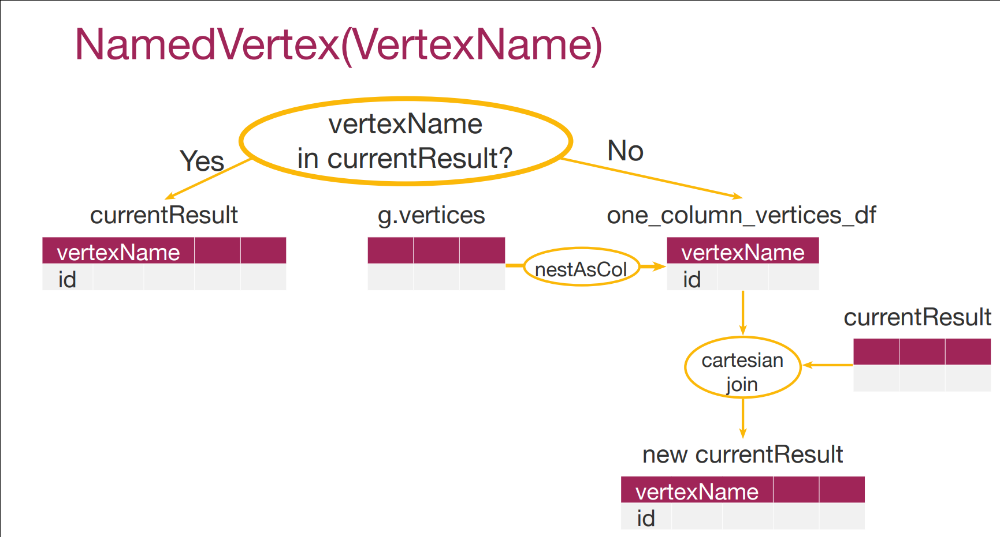

**If AnonymousVertex**
Do nothing

**If NamedEdge**
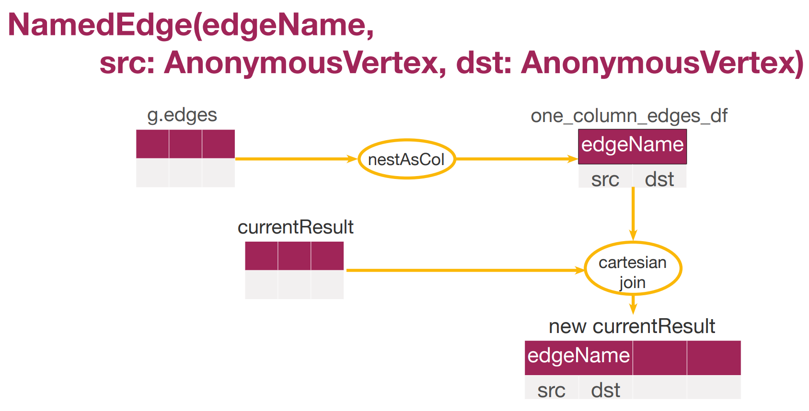

**If src AnonymousVertex and dst Named**
The same if reverced
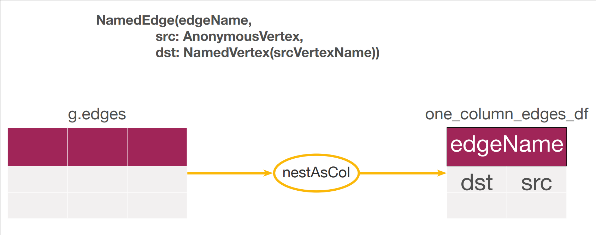

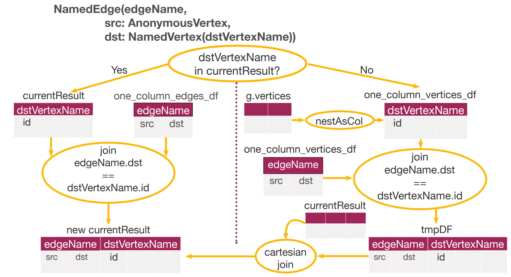

**If src Named and dst Named**
4 cases
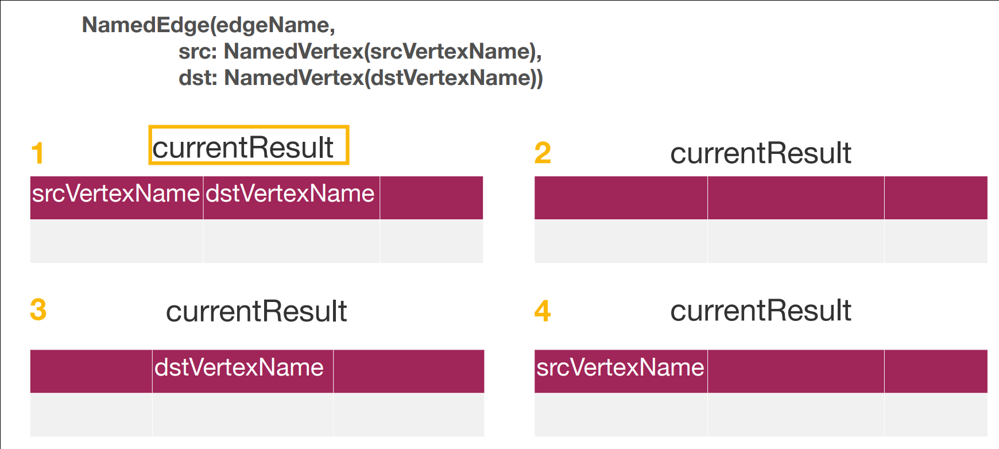

But for all first
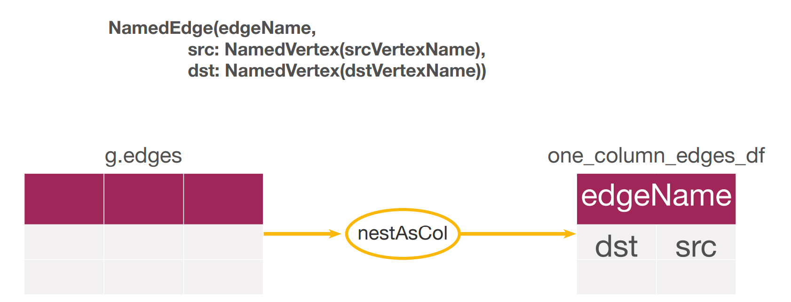

1. First case 
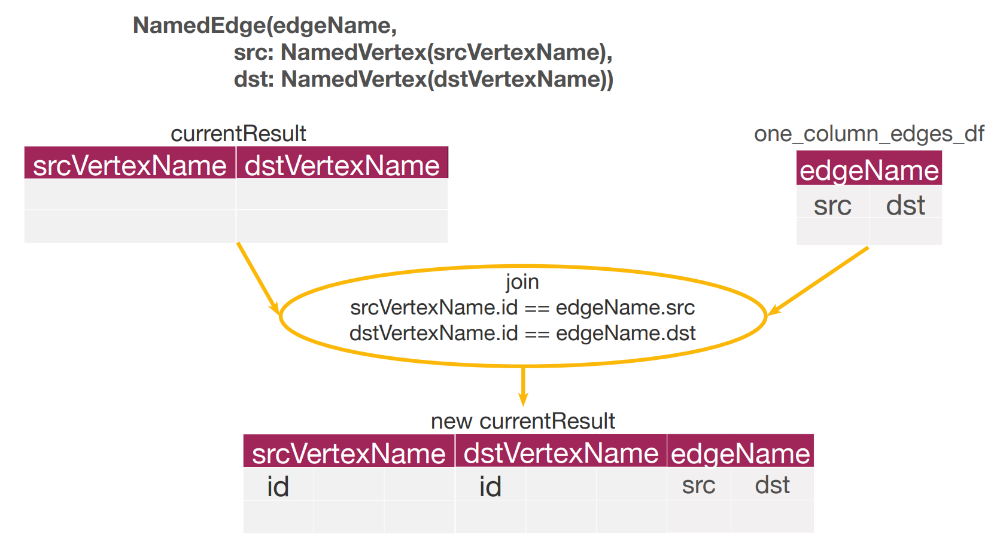

2. Second case
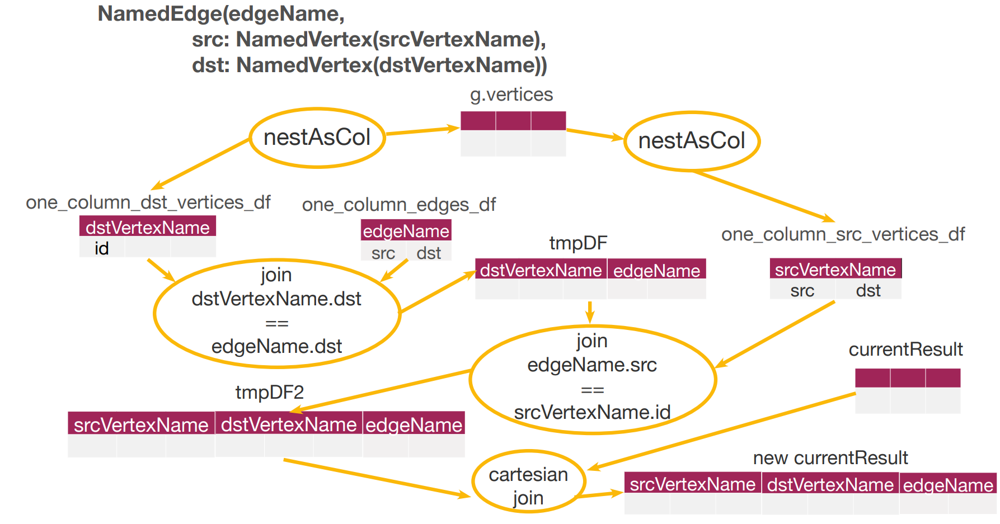

3. Third case
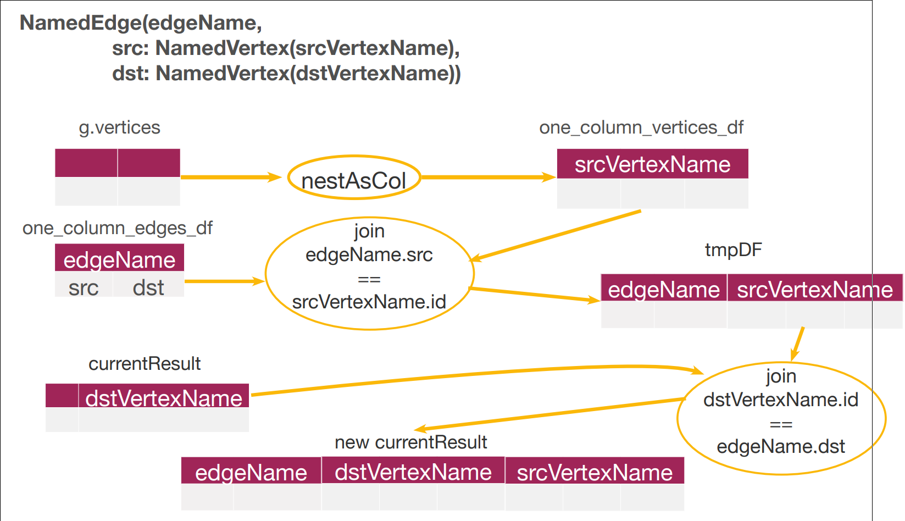

4. Fourth case
The same as 3, but src <-> dst

**If AnonymousEdge**
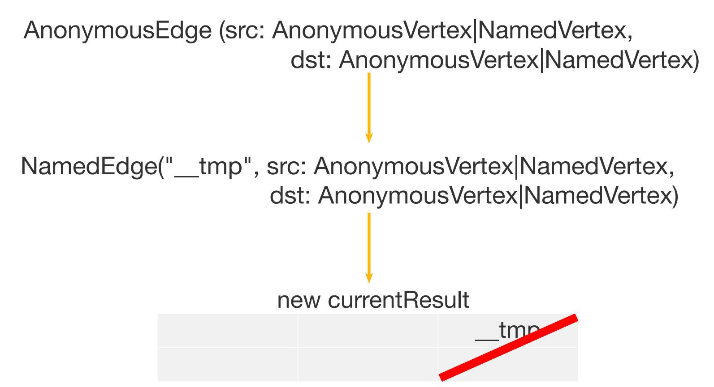

**If Negation**
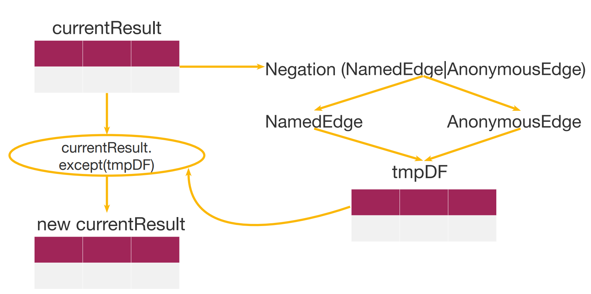


#### Motif finding: counting shuffles

`abcDF = abDF.join(bcDF, "B").filter("A = 1")` - 1 join
```
+---+---+---+
| B| A| C|
+---+---+---+
| 3| 1| 4|
| 3| 1| 5|
| 3| 1| 6|
| 3| 1| 7|
+---+---+---+
```

`motifs = gf.find("(A)-[]->(B); (B)-[]->(C)").filter("A != C")` - 4 joins
```
+--------------------+--------------------+-------------------+
| A| B| C|
+--------------------+--------------------+-------------------+
| [1,Alex,28,M,MIPT]| [2,Emeli,28,F,MIPT]| [1,Alex,28,M,MIPT]|
|[3,Natasha,27,F,S...| [2,Emeli,28,F,MIPT]| [1,Alex,28,M,MIPT]|
| [5,Oleg,35,M,MIPT]| [2,Emeli,28,F,MIPT]| [1,Alex,28,M,MIPT]|
| [1,Alex,28,M,MIPT]|[3,Natasha,27,F,S...| [1,Alex,28,M,MIPT]|
```

## Triangles Count

Triangle, in terms of graph, - it's a set of 3 vertices provided. There is an edge between any 2 of them. 

Number of triangles passing through vertex - it is a number of triangles that contains vertex A as a element of free element set.

`results = g.triangleCount()`
this algorithm ignores edge direction.

each triangle will be found just once.

Flipping
flipping edges in a way that source of each edge is less than destination and dropping all duplicate afterwards.

**TrianglesCount algorithm:**
1. Flip all edges in such way as src < dst and delete all duplicates
0 shuffles
2. Find all triangles with motif using pattern “(A)-[]->(B); (B)-[]->(C); (A)-[]->(C)”
6 shuffles
3. Explode triangles and count occurrence of each vertex
1 shuffles
4. Join info about triangles for each vertex with original info about it
1 shuffles