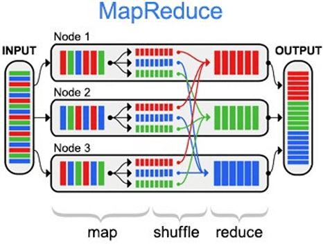

# MapReduce

Is a programming model and an associated implementation for processing and generating big data sets with a parallel, distributed algorithm on a cluster.

A MapReduce framework (or system) is usually composed of three(or four) operations (or steps):

**Splitting** (optional). 
Input Splits: An input to a MapReduce in Big Data job is divided into fixed-size pieces called input splits Input split is a chunk of the input that is consumed by a single map 

**Map**: each worker node applies the map function to the local data, and writes the output to a temporary storage (each split is passed to a mapping function to produce output values). A master node ensures that only one copy of the redundant input data is processed.

**Shuffle**: worker nodes redistribute data based on the output keys (produced by the map function), such that all data belonging to one key is located on the same worker node.

**Reduce**: worker nodes now process each group of output data, per key, in parallel.
In this phase, output values from the Shuffling phase are aggregated. This phase combines values from Shuffling phase and returns a single output value. In short, this phase summarizes the complete dataset.

## MapReduce Architecture explained in detail
* One map task is created for each split which then executes map function for each record in the split.
* It is always beneficial to have multiple splits because the time taken to process a split is small as compared to the time taken for processing of the whole input. When the splits are smaller, the processing is better to load balanced since we are processing the splits in parallel.
* However, it is also not desirable to have splits too small in size. When splits are too small, the overload of managing the splits and map task creation begins to dominate the total job execution time.
* For most jobs, it is better to make a split size equal to the size of an HDFS block (which is 64 MB, by default).
* Execution of map tasks results into writing output to a local disk on the respective node and not to HDFS.
* Reason for choosing local disk over HDFS is, to avoid replication which takes place in case of HDFS store operation.
* Map output is intermediate output which is processed by reduce tasks to produce the final output.
* Once the job is complete, the map output can be thrown away. So, storing it in HDFS with replication becomes overkill.
* In the event of node failure, before the map output is consumed by the reduce task, Hadoop reruns the map task on another node and re-creates the map output.
* Reduce task doesn't work on the concept of data locality. An output of every map task is fed to the reduce task. Map output is transferred to the machine where reduce task is running.
* On this machine, the output is merged and then passed to the user-defined reduce function.
* Unlike the map output, reduce output is stored in HDFS (the first replica is stored on the local node and other replicas are stored on off-rack nodes). So, writing the reduce output

## Links

https://en.wikipedia.org/wiki/MapReduce
https://www.bigdataschool.ru/wiki/mapreduce
https://www.ibm.com/developerworks/ru/library/cl-mapreduce/index.html