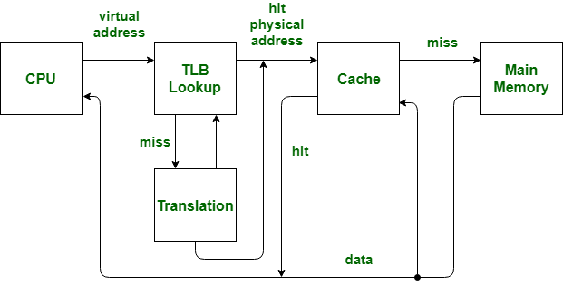

# What’s difference between CPU Cache and TLB?

Both CPU Cache and TLB are hardware used in microprocessors

## CPU Cache

**CPU Cache** is a fast memory which is used to improve latency of fetching information from Main memory (RAM) to CPU registers. So CPU Cache sits between Main memory and CPU. And this cache stores information temporarily so that the next access to the same information is faster. A CPU cache which used to store executable instructions, it’s called Instruction Cache (I-Cache). A CPU cache which is used to store data, it’s called Data Cache (D-Cache). So I-Cache and D-Cache speeds up fetching time for instructions and data respectively. A modern processor contains both I-Cache and D-Cache. For completeness, let us discuss about D-cache hierarchy as well. D-Cache is typically organized in a hierarchy i.e. Level 1 data cache, Level 2 data cache etc.. It should be noted that L1 D-Cache is faster/smaller/costlier as compared to L2 D-Cache. But the basic idea of ‘CPU cache‘ is to speed up instruction/data fetch time from Main memory to CPU.

## TLB - Translation Lookaside Buffer

**Translation Lookaside Buffer (i.e. TLB)** is required only if Virtual Memory is used by a processor. 
TLB speeds up translation of virtual address to physical address by storing page-table in a faster memory. In fact, TLB also sits between CPU and Main memory. 
Precisely speaking, TLB is used by MMU when virtual address needs to be translated to physical address. By keeping this mapping of virtual-physical addresses in a fast memory, access to page-table improves. It should be noted that page-table (which itself is stored in RAM) keeps track of where virtual pages are stored in the physical memory. In that sense, TLB also can be considered as a cache of the page-table.

But the scope of operation for TLB and CPU Cache is different. TLB is about ‘speeding up address translation for Virtual memory’ so that page-table needn’t to be accessed for every address. CPU Cache is about ‘speeding up main memory access latency’ so that RAM isn’t accessed always by CPU. TLB operation comes at the time of address translation by MMU while CPU cache operation comes at the time of memory access by CPU. In fact, any modern processor deploys all I-Cache, L1 & L2 D-Cache and TLB.

## Links

https://www.geeksforgeeks.org/whats-difference-between-cpu-cache-and-tlb
https://software.rajivprab.com/2018/04/29/myths-programmers-believe-about-cpu-caches/